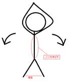
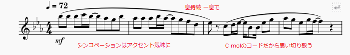

# 2022年度 パート練習計画
 Written by: 渡辺一稀(2年 Tuba)  
 これはTubaパート内でしている練習内容をまとめたドキュメントである。別のReadme.mdも参照してほしい

# 練習全体についての説明
 ## 計画について
  　このパート練習計画は、「個人とパート、両方の技術を向上させる」ことを目的としている。  
  　「個人」は、奏者一人のことを指す。パートの中の一人、という捉え方は可能だが、ここではそれを外しておく。奏者一人の技術が未熟では、パート全体の技術を平均したとき、その一人によって平均値は下がってしまうのである。それを各自で解決させるのが個人練習の役割だろう。この計画では、それらを意識した練習を組んでいる。  
  　「パート」とは、「個人の集まり」という単位だが、単に個人が集まっただけではないはずである。個人が集まり、その中で様々なものが揃って初めて「パート」という単位を使えるのだと思う。決して、如何なる状態でもパートという単位が使用可能かと言えば、そうではないのだろう。そのため、全員の足並みを揃え、パートという単位を使用可能にするための練習がパートでの合わせ、となる。この計画では、それを意識した練習を組み込んでいる。  
  　個人練習ばかりをしていると、個人の力は身につくが、パート全体では足並みが乱れかねない。反対に、パートで合わせてばかりいると、個人の技術を向上させる暇がなくなってしまう。この計画では、そのバランスを適度に取った練習を意識している。  
  　が、どうしても30分では両方をすることは難しい。そのため、30分の練習では、優先度の高い個人練習に注力したメニューを組んでいる。一方の60分の練習は、個人練習からパートで合わせる練習までの、これに含まれる全ての練習をすることが可能だ。  
  　ただ、忙しい時期(コンクール直前など)は短時間での練習が多くなると推測できるため、基本となる「必要なこと」を両方に、その次にある「できたら良いこと」は60分の計画に練りこんである。  
 ## 個人練習について
  　前述の通り、個人練習では「各自の技術不足などの問題を各自で解決させること」を意識した練習を組んでいる。個人が抱える問題というものは、その人によって異なる。そのため、「全体で向上させる個人の技術」を練習メニューに加え、個人の問題を解決するための時間を挿入した。これにより、受動的な練習では手の届かないところまで個人の力で目を行き届かせることが可能となる。  
  　また、問題解決の時間は誰かの指示で練習をするわけではないため、「積極性のある練習」を可能とすることができる。受動的な練習より、積極的な練習の方が、技術を向上させるスピードは速くなるため、積極的な練習をしやすい環境を整えることは、練習内容の向上にもつながると考えられる。  
 ## パート基礎練習について
  　パート基礎練習では、「全体で足並みを揃えること」を曲中のみならず、日頃から習慣的にすることを意識している。また、個人練習によって得られた技術の確認、という意味もある。  
  　「基礎練習は一人でするもの」という考え方があるが、確かにそれはその通りである。しかし、「基礎の確認」は複数人でするものであろう。それをパート全員ですることにより、パートの統一感を向上できる。  
  　また、個人練習だけでは得られない音程感や他のメンバーからの指摘などを得る機会でもある。  

# 準備についての説明
 ## 楽器を出した後のマウスピースの予備練習
  　楽器を出した後、マウスピースを用いた予備練習の時間を設けている。(北原先生のレッスン参照)  
  　これにより、今まで授業などで使わなかった唇を激しく使う前の「慣らし」をすることができる。
 ## 仮チューニング
  　マウスピースでの予備練習をしただけでは、楽器も自分の口も準備万端でない状態である。そのため、前日の記録を参考にして管を抜いて大体の音程を合わせる。そのための時間である。  
# 呼吸練習についての説明
  　呼吸練習については、部活動の時間外でしてほしい。楽器に触れたり、複数人で集中して合わせたりできるのは部活動の時間のみのため、この時間外にできることはその時にしたい。  
  　しかしながら、その一例もここに掲載する。各自参考にしてほしい。
 ## ロングブレス
   　ロングトーンみたいなこの練習は、ロングトーン同様、「良い息で長い息を出す」ための練習である。  
   　方法は単純で、立って8秒間、あるいは16秒間息を吐くだけである。吸うのは2秒間だけ。これを8セットする。  
　ただし、真っ直ぐな息であること、十分な息の量であること、吐いている間は同じ息の量であることなど、多くのことを注意する必要がある。  
 ## 腹筋呼吸
   　腹式呼吸をするときには、腹筋の力が特に重要である。そのため、呼吸練習の過程で、強制的に腹筋も鍛えよう、という練習がこれである。  
   　方法は、仰向きの状態で、上記のロングブレスと同様のことをする。  
   　ただし、8セット中前半は床と背中の間の角度が20度程度、後半は45度程度でする。また、視線は自らの臍を見るようにする。  
 ## 柔軟呼吸
   　下図のような体勢での呼吸練習。2拍吸って4拍吐く。  
   　これは肺活量というより、呼吸を楽にするためのストレッチに近い。  
   　左右それぞれ4セット、胴の側面を伸ばす。  
     
 ## 高速呼吸
   　一拍で吐き切って吸うことを繰り返す呼吸練習。酸欠注意、辛くなったら座ること。  
   　口に手を持っていくやり方もあるが、ここでは自らの腹に手を持っていく。マスクについては各自で。  
   　この練習では、拍の表裏の感覚が重要である。クリック音は表しかならないため、タイミング良く裏で吸う必要がある。  
   　また、吐くときも少しだけ吐くのではなく、吐けるだけ吐くところにこの練習の効果が現れる。吐くときは、広がる息ではなく、真っ直ぐな息だとやりやすいだろう。  
   |吐き方|どうなる|
   |:---:|:---:|
   |少しだけ吐くと|重い呼気が溜まり、次第に辛くなる。ffを出す練習にはなり得ない。|
   |たくさん吐くと|吸気があるため、多少は楽。ffを出す練習、短いブレスの練習になる。|

# 個人練習についての説明
 ## 音出し(BPM84)
   　音出しでは、low B♭からチューニングB♭までを綺麗に出せるようにする。  
   　「振動の始まり」を確かめる練習が有効だろう。また、可能ならば幅広い音域の音を出せると良い。  
 ## 音階練習(BPM84)
   　この練習では、以下の三つの音階を練習する。  
   1. 十二長音階  
   2. 十二自然短音階  
   3. 半音階  
   　長音階と短音階は、一方を上行時に、他方を下降時にする。半音階は、両方一度にする。これにより、初見に強くなれる他、自然と音域の拡張にも繋がっている。
 ## リップスラー(BPM72)
   　リップスラーは朝練などの教則本を使った練習をする。リップスラーでlow EからチューニングB♭を出せるようにするが、音自体も、その間も綺麗にすることが重要である。  
   　このとき、白玉でスラーをかける練習は、リリースを意識する。上行時は、音を舌で止めたリリースを、下降時は息を送るようなリリースをする、など。  
 ## タンギング+跳躍(BPM72)
   　タンギングは、オリジナルの譜面で練習する。長短二度～完全五度+トライトーンの音程の跳躍も含む。また、「音色の統一」という面では、ソノリテ的な面もある。
 ## ロングトーン [30分のみ] (BPM60、クリック=120)
　8,16拍のロングトーンをする。モードは日替わりだが、根音は毎日B♭。  
 ## 基礎練習の開拓 [60分のみ]
   　上記の練習で、個人基礎練習は終了だが、これら以外にも、もっとたくさんの練習が必要である。また、上記の練習で思うようにできていない部分があるかもしれない。そのような練習をするための時間がこの時間である。各自で考え、各自に必要な練習をしよう。  
 ## 曲練習
   　個人で曲の練習。記譜されたテンポより遅くし、課題は自分で見つける。  

# パート基礎練習・パート合わせについての説明 [60分のみ]
  　以下の内容は60分版のみであり、30分版では含まれない内容である。また、ここに書かれている代表者は日替わりであり、全員に等しく責任感が与えられる。  
 ## グループチューニング
   　チューニングを耳で合わせるのは、電子音より生音のほうがやりやすいが、生音自体をチューニングしなければならない。そのため、一度全員がキーボードに合わせた後、その日の代表者に確認として合わせていく形とする。  
 ## グループ練習1(BPM84)
   　全員でスケール練習をするが、代表者はキーボードで根音を鳴らす。その音にスケールを乗せる。根音との音程を感じることで、音程感を鍛えることができる。  
   　また、この練習では十二旋律的短音階とその他のモードで根音がB♭の音階を二つする。普段よく使う長音階や自然短音階とは異なるスケールの練習を半ば強制的にすることで、より初見奏に強くなれる。  
 ## グループ練習2(BPM84)
   　全員でリップスラーをするが、スケール練習と同様に。根音との音程感を大切に。  
   　この練習は協和音程のハーモニーを感じることができる練習のため、より顕著に音程感を感じられると思う。  
 ## グループ練習3(BPM84)
   　全員で半音階のリレーロングトーンをする。低音域も高音域も、出しやすい音域から遠ざかる。  
   　代表者が先に4拍吹き、次のメンバーが4拍開けて4拍吹く。その間、吹かない人は吹いた人に何かコメントをする。  
   　リレー練習的なものをする理由として、全員の音色やアタックなどをここで揃えるためである。音程や音価も大切だが、「良い音」で出すことが重要。  
 ## グループロングトーン(BPM60、クリック=120)
   　全員で根音=B♭のスケールでロングトーンをする。代表者がキーボードを四拍鳴らした後、2拍開けて吹く。8,12,16拍でする。根音=B♭のモード(アイオニアンとエオリアンを除く)を日替わりですることで、長音階や短音階に限らない音階にも慣れることができると考えられる。  
 ## 曲合わせ
   　パート内で曲を合わせる。記譜されたテンポより遅くするが、課題の探り合いを推奨する。そのとき、以下のことを注意するとよいだろう。  
   * 音が、楽器が同じくらい鳴っているか(より鳴っているほうに合わせる)。  
   * 音色の統一(その場にあった表現を)。  
   *縦の線の意識(決め所はもちろん、そのほかのところも。ベースラインが曖昧ではいけない)。  
   　また、一人ずつ確認する(通称:公開処刑)を実施するのも効果的だろう。集団に埋もれたミスを明らかにすることが可能となる。  

# 練習以外での動きについて
 ## スケジュール
  　練習時間以外(部活直前等)に、一週間、あるいは一か月の予定について確認する。  
  　進捗状況の確認以外に、計画性のある練習をする環境を作るためでもある。  
  　予定は頭の中ではなく、現実に実物がある状態で作る。そうすると、予定の共有ができ、互いに互いの予定を参考にしながら、新たにより良い予定を組むことが可能となるからである。  
  　また、スケジュールを立てることで、だらだらとした練習をしなくなり、本番までに完成された音楽を作れる。そのためには、「本番一週間前」の気持ちで練習に臨むのが必要だろう。  
 ## 楽譜の読み込み
  　どこができていないか、どのように表現するのか、というものを決めるためにも、楽譜を読み込んでおく作業、そしてそれを共有する作業が必要だろう。以下一例(赤字がコメント)。  
  
 ## 練習のフィードバック確認
  　練習の効果を客観的に評価するためのこともしたい。パート内でソロコンテスト的なことをしたり、合わせる時に、メンバーを評価しあう(リレーロングトーンみたく)のもしてみたい。まだ計画中  
 ## 部活動以外の時間での練習
  　どの楽器でも、集中して楽器に触れる時間というのは部活動の時間が多くを占めるだろう。そのため、部活動の時間はできる限り長い時間楽器に触れ、それ以外の時間はそうでない練習に取り組むとよいだろう。以下はその一例である。  
  * 登校中に呼吸練習(2拍で吸って8拍で吐く。歩く速さでタイムをとる)。  
  * 楽譜の読み込み(指を紐づける作業をしていてはいけない。楽曲を理解する作業である)。  
  * 読み込んだ楽譜の出力(声に出す。ma-で歌ったり、タンギングをつけたla-で歌ったりして分ける)。  
  　呼吸の練習については、家にいるときにできることも多い。  

# 最後に
 　以上がパート練習計画の内容だ。基礎が未熟である以上、そこをしっかりさせないと、曲を完成させることも難しくなってしまうだろう。そう考えると、ある程度パート練習に時間を割くことも無くは無いと思われる。  
 　しかしながら、「パートで合わせた練習」ばかりをしていては、個人練習によって得られるものや、個人の積極性を失いかねない。けれども、個人練習だけではパート内の統一感も失われてしまう。そこのバランスを取った練習をすることが、一番の課題なのだろうが、30分でそんなことは非常に難しい。  
 　いずれにせよ、パート練習に確固たる信頼がない現状を改善しなければならないことは確かである。何とか改善し、今後の重奏や合奏に繋げられるようにしたい。  

# 更新履歴
 * 2022/12/6 作成  
 * 2023/1/29 フォーマットの大幅な更新(OpenDocument->MarkDown)  